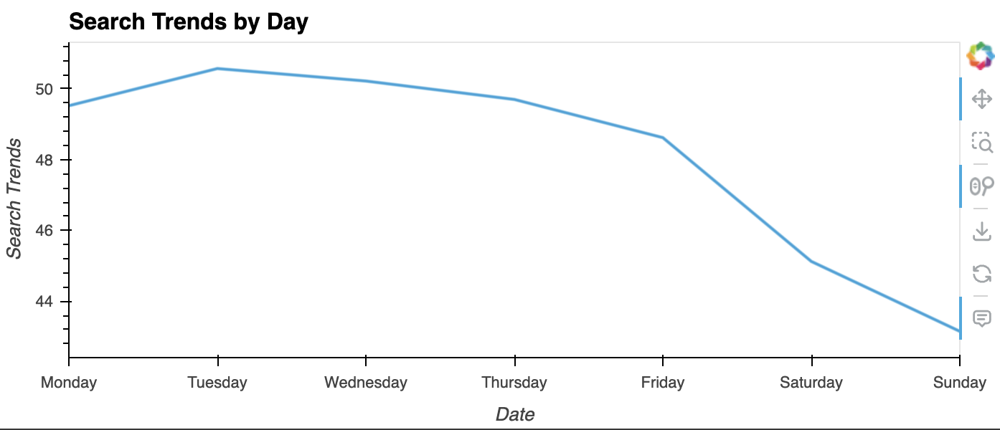
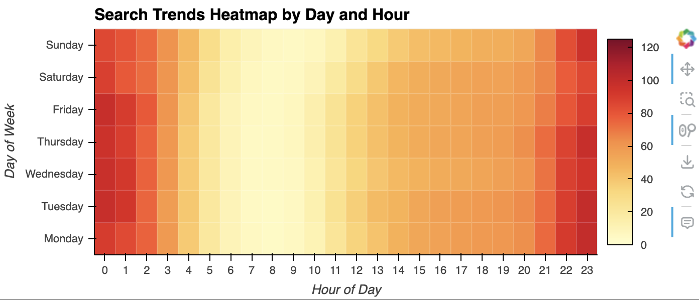
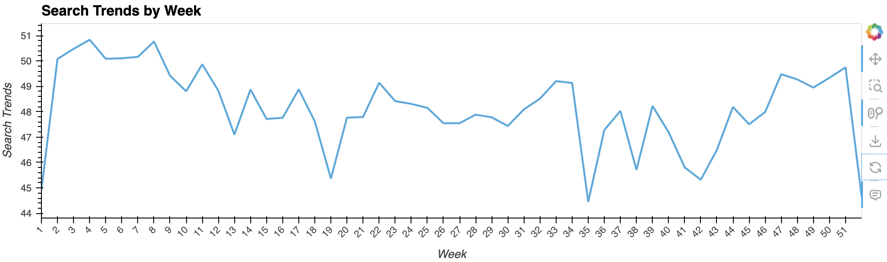
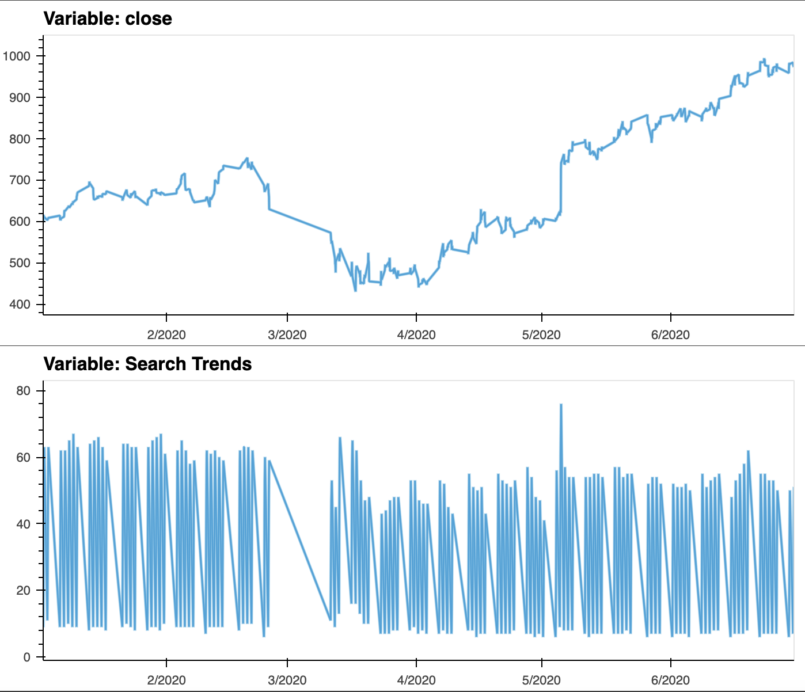
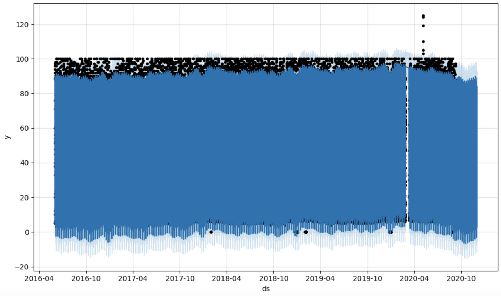
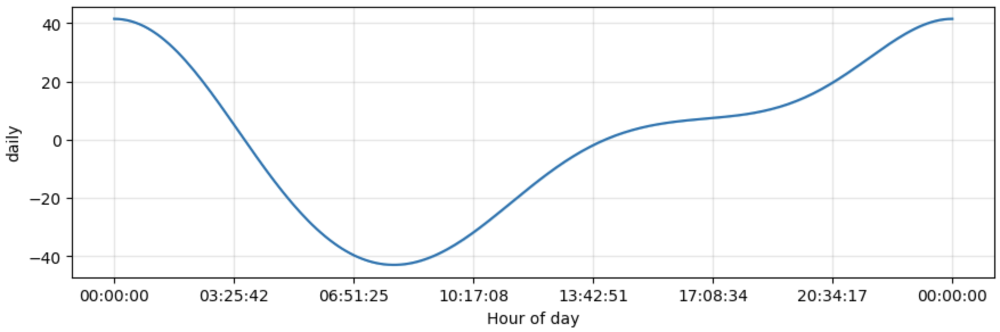
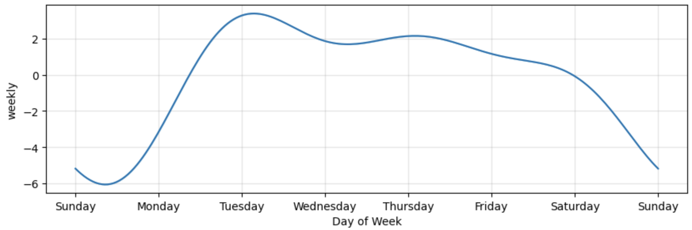
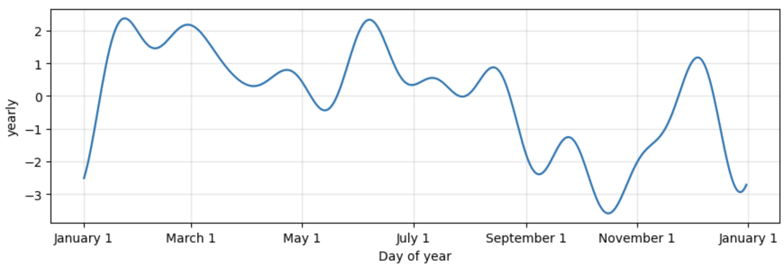
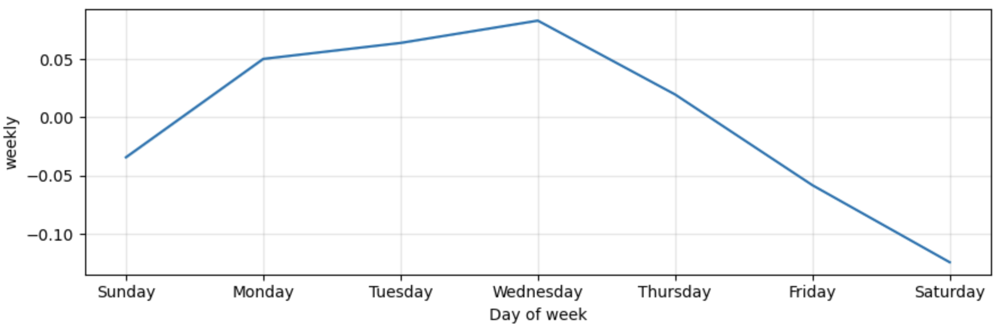

# Module 11 Challenge: Forecasting Net Prophet

## Files

[Forecasting Net Prophet notebook](forecasting_net_prophet_dk.ipynb)

[Data files](Resources)

---

## Instructions

First, configure a Google Colaboratory, or Colab, workspace as follows:

1. Open [Google Colab](https://colab.research.google.com/), and then upload your starter notebook.

2. Run the provided code in the “Install and import the required libraries and dependencies” section. Note the following:

   - The first cell installs the necessary libraries into the Google Colab runtime.

   - The second cell imports the dependencies for use in the notebook.

With your workspace configured, you can begin the assignment. The instructions are divided into four steps and an optional fifth step as follows:

- Step 1: Find unusual patterns in hourly Google search traffic.

- Step 2: Mine the search traffic data for seasonality.

- Step 3: Relate the search traffic to stock price patterns.

- Step 4: Create a time series model by using Prophet.

- Step 5 (optional): Forecast the revenue by using time series models.

The following subsections detail these steps.

### Step 1: Find Unusual Patterns in Hourly Google Search Traffic

The data science manager at Mercado Libre asks you if the Google search traffic for the company links to any financial events at the company. Or, does the search traffic data just present random noise? To answer this question, you’ll pick out any unusual patterns in the Google search data for the company, and connect them to the corporate financial events.

Answering the question requires you to complete the following steps:

1. Read the search data into a DataFrame, and then slice the data to just the month of May 2020. (During this month, Mercado Libre released its quarterly financial results.) Use hvPlot to visualize the results. Do any unusual patterns exist?

2. Calculate the total search traffic for the month, and then compare the value to the monthly median across all months. Did the Google search traffic increase during the month that Mercado Libre released its financial results?

### Step 2: Mine the Search Traffic Data for Seasonality

The Marketing department realizes that they can use the hourly search data, too. If they can track and predict interest in the company and its platform for any time of day, they can focus their marketing efforts around the times that have the most traffic. This will get a greater return on investment (ROI) from their marketing budget.

To help Marketing, you'll want to mine the search traffic data for predictable seasonal patterns of interest in the company. Complete the following steps:

1. Group the hourly search data to plot the average traffic by the day of the week (for example, Monday vs. Friday).

2. Using hvPlot, visualize this traffic as a heatmap, referencing `index.hour` for the x-axis and `index.dayofweek` for the y-axis. Does any day-of-week effect that you observe concentrate in just a few hours of that day?

3. Group the search data by the week of the year. Does the search traffic tend to increase during the winter holiday period (weeks 40 through 52)?

### Step 3: Relate the Search Traffic to Stock Price Patterns

During a meeting with people in the Finance group, you mention your work on the search traffic data. They want to know if any relationship between the search data and the company stock price exists, and they ask if you can investigate.

You can find out the answer by completing the following steps:

1. Read in and plot the stock price data. Concatenate the stock price data to the search data in a single DataFrame.

2. Note that market events emerged during 2020 that many companies found difficult. But after the initial shock to global financial markets, new customers and revenue increased for e-commerce platforms. So, slice the data to just the first half of 2020 (`2020-01` to `2020-06` in the DataFrame), and then use hvPlot to plot the data. Do both time series indicate a common trend that’s consistent with this narrative?

3. Create a new column in the DataFrame named “Lagged Search Trends” that offsets, or shifts, the search traffic by one hour. Create two additional columns:

   - “Stock Volatility”, which holds an exponentially weighted four-hour rolling average of the company’s stock volatility

   - “Hourly Stock Return”, which holds the percentage of change in the company stock price on an hourly basis

4. Review the time series correlation, and then answer the following question: Does a predictable relationship exist between the lagged search traffic and the stock volatility or between the lagged search traffic and the stock price returns?

### Step 4: Create a Time Series Model by Using Prophet

Now, you need to produce a time series model that analyzes and forecasts patterns in the hourly search data. Complete the following steps to create the model:

1. Set up the Google search data for a Prophet forecasting model.

2. After estimating the model, plot the forecast. What is the near-term forecast for the popularity of Mercado Libre?

3. Plot the individual time series components of the model to answer the following questions:

   - What time of day exhibits the greatest popularity?

   - Which day of the week gets the most search traffic?

   - What's the lowest point for search traffic in the calendar year?

### Step 5 (Optional): Forecast the Revenue by Using Time Series Models

A few weeks after your initial analysis, the finance group follows up to find out if you can help them solve a different problem. Your fame as a growth analyst in the company continues to grow!

Specifically, the finance group wants a forecast of the total sales for the next quarter. This will dramatically increase their ability to both plan budgets and help guide expectations for the company investors.

To create the forecast, complete the following steps:

1. Read in the daily historical sales (that is, revenue) figures, and then apply a Prophet model to the data.

2. Interpret the model output to identify any seasonal patterns in the company revenue. For example, what are the peak revenue days? (Mondays? Fridays? Something else?)

3. Produce a sales forecast for the finance group. Give them a number for the expected total sales in the next quarter. Include the best- and worst-case scenarios to help them make better plans.

---

## Trend Analysis Report

**Question:** Did the Google search traffic increase during the month that MercadoLibre released its financial results?

**Answer:**  Yes - The Google search traffic increased during the month MercadoLibre released its financial results in May of 2020. It increased by 3,000 compared to the median monthly traffic.

**Question:** Does any day-of-week effect that you observe concentrate in just a few hours of that day?

**Answer:** Yes - The search trends concentrate between 9pm and 2am.

**Question:** Does the search traffic tend to increase during the winter holiday period (weeks 40 through 52)?

**Answer:** Yes - Search trends tend to increase from 45.321 to 49.747

**Question:** Do both time series indicate a common trend that’s consistent with this narrative?

**Answer:** The close price indicates a trend that is consistent with the narrative.  The close price falls starting in March but then starts to rise in April to new highs.  The search trends seem relatively stable prior to March, with a pause in searching for the first half of March, followe dby continued searches after mid-March.  The resumed searches do not match the same level as the trends prior.

**Question:** Does a predictable relationship exist between the lagged search traffic and the stock volatility or between the lagged search traffic and the stock price returns?

**Answer:** There is a slight positive relationship between Lagged Search Trends and the Hourly Stock Return.  There is a small negative correlation between the Lagged Search Trends and the Stock Volatility.  There is not a strong predictable relationship between the variables.

|  | Stock Volatility | Lagged Search Trends | Hourly Stock Return |
| :--- | :---:        |    :----:   |          :---: |
| Stock Volatility | 1.00000 | -0.148938 | 0.061424 |
| Lagged Search Trends | -0.148938 |  1.00000  | 0.017929  |
| Hourly Stock Return | 0.061424 | 0.017929 | 1.00000 |

**Question:**  How's the near-term forecast for the popularity of MercadoLibre?

**Answer:** There appears to be a projected slight dip in popularity of MercadoLibre in the near term. 

**Question:** What time of day exhibits the greatest popularity?

**Answer:** Overnight between 8pm - 2am.

**Question:** Which day of week gets the most search traffic?
   
**Answer:** Tuesday

**Question:** What's the lowest point for search traffic in the calendar year?

**Answer:** October

## Forecasting Sales Report

**Question:** For example, what are the peak revenue days? (Mondays? Fridays? Something else?)

**Answer:** Monday - Wednesday are peak revenue days, culminating on Wednesday.

### Produce a sales forecast for the finance division, giving them a number for expected total sales next quarter. Include best and worst case scenarios, to better help the finance team plan.

**Answer:** The projected sales for the next quarter are 970.  In the optimal scenario, the company may sell 1,053.  In the worst case scenario, the company may sell 888.  It is recommended to have at least 1,053 units available to be sold this next quarter.

|  | Sales Forecast | 
| :--- | :---:        |  
| Best Case | 1052.159332 | 
| Worst Case | 887.681072 | 
| Most Likely Case | 969.607769 | 